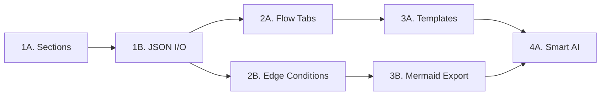

# FlowMind AI — Feature Implementation Plan

A phased plan to evolve FlowMind AI from a single-canvas flow editor into a full-featured, multi-flow diagramming tool with sections, persistence, and richer interactions.

---

## Codebase Overview

| File | Role | Lines |
|------|------|-------|
| [App.tsx](file:///Users/varun/Desktop/Dev_projects/flowmind-ai/App.tsx) | Main editor, state, undo/redo, export, AI | 569 |
| [types.ts](file:///Users/varun/Desktop/Dev_projects/flowmind-ai/types.ts) | Node/edge type definitions | 48 |
| [CustomNode.tsx](file:///Users/varun/Desktop/Dev_projects/flowmind-ai/components/CustomNode.tsx) | Themeable node renderer with icons, markdown, images | 147 |
| [AnnotationNode.tsx](file:///Users/varun/Desktop/Dev_projects/flowmind-ai/components/AnnotationNode.tsx) | Sticky note node | 44 |
| [PropertiesPanel.tsx](file:///Users/varun/Desktop/Dev_projects/flowmind-ai/components/PropertiesPanel.tsx) | Right-side properties editor for nodes/edges | 543 |
| [Toolbar.tsx](file:///Users/varun/Desktop/Dev_projects/flowmind-ai/components/Toolbar.tsx) | Bottom toolbar (add, AI, export, undo/redo) | 131 |
| [AIPanel.tsx](file:///Users/varun/Desktop/Dev_projects/flowmind-ai/components/AIPanel.tsx) | AI prompt input modal | 103 |
| [geminiService.ts](file:///Users/varun/Desktop/Dev_projects/flowmind-ai/services/geminiService.ts) | Gemini API integration for flow generation | 89 |

---

## Phase 1: Core Features (P0)

### 1A. Sections / Flow Groups

Sections are **container nodes** that visually group related nodes. ReactFlow supports this natively via `parentNode` + `extent: 'parent'` on child nodes.

#### [MODIFY] [types.ts](file:///Users/varun/Desktop/Dev_projects/flowmind-ai/types.ts)

- Add `NodeType.SECTION = 'section'` to the enum
- Add `sectionId?: string` to `NodeData` (tracks which section a node belongs to)

#### [NEW] [SectionNode.tsx](file:///Users/varun/Desktop/Dev_projects/flowmind-ai/components/SectionNode.tsx)

A new custom node component for sections:
- Large container with a **title bar** (editable label), subtle colored background, dashed border
- Minimum size: 400×300px, resizable via `NodeResizer`
- Supports color theming (reuse existing color palette)
- Title bar at top with section name + node count badge
- Visual style: semi-transparent background (e.g., `bg-blue-50/30`), rounded corners, dashed border
- **Collapsible**: A toggle button in the title bar to collapse/expand
  - When collapsed: shows only the title bar + a summary (e.g., "5 nodes")
  - When expanded: shows all child nodes

#### [MODIFY] [App.tsx](file:///Users/varun/Desktop/Dev_projects/flowmind-ai/App.tsx)

- Register `section: SectionNode` in `nodeTypes`
- Add `handleAddSection` callback:
  - Creates a new section node at a random position
  - Section nodes use `style: { width: 500, height: 400 }` and `type: 'section'`
- Implement **drag-into-section** logic:
  - On `onNodeDragStop`, check if a non-section node overlaps with any section node
  - If so, set `parentNode: sectionId` and `extent: 'parent'` on the child
  - Update child position to be relative to the section
- Implement **drag-out-of-section** logic:
  - If a node is dragged outside its parent section bounds, remove `parentNode` and convert position back to absolute
- Update `onLayout` (dagre) to handle sections:
  - Group nodes by section, layout within each section independently
  - Layout sections themselves relative to each other

#### [MODIFY] [Toolbar.tsx](file:///Users/varun/Desktop/Dev_projects/flowmind-ai/components/Toolbar.tsx)

- Add "Add Section" button (icon: `Group` from lucide-react) next to "Add Sticky Note"
- Wire to `handleAddSection` callback

#### [MODIFY] [PropertiesPanel.tsx](file:///Users/varun/Desktop/Dev_projects/flowmind-ai/components/PropertiesPanel.tsx)

- When a section node is selected, show:
  - Section title editor
  - Color theme picker (reuse existing)
  - List of child nodes inside the section
  - "Remove from section" button for child nodes
- Add `section` to the `NODE_TYPES` array

---

### 1B. JSON Import/Export

Allow saving and loading flow diagrams as `.json` files.

#### [MODIFY] [types.ts](file:///Users/varun/Desktop/Dev_projects/flowmind-ai/types.ts)

Add a `FlowDocument` interface:
```typescript
export interface FlowDocument {
  version: string;           // Schema version (e.g., '1.0')
  name: string;              // Flow name
  createdAt: string;         // ISO timestamp
  nodes: Node[];
  edges: Edge[];
}
```

#### [MODIFY] [App.tsx](file:///Users/varun/Desktop/Dev_projects/flowmind-ai/App.tsx)

- Add `handleExportJSON` callback:
  - Serializes `{ version: '1.0', name: 'Untitled Flow', createdAt: new Date().toISOString(), nodes, edges }` to JSON
  - Creates a downloadable `.json` file via `Blob` + `URL.createObjectURL`
- Add `handleImportJSON` callback:
  - Opens a file picker (`<input type="file" accept=".json">`)
  - Reads the file, parses JSON, validates structure
  - Calls `setNodes(parsed.nodes)` and `setEdges(parsed.edges)`
  - Calls `fitView()` after loading
  - Shows error toast if invalid format

#### [MODIFY] [Toolbar.tsx](file:///Users/varun/Desktop/Dev_projects/flowmind-ai/components/Toolbar.tsx)

- Add "Save JSON" button (icon: `Save` from lucide-react)
- Add "Load JSON" button (icon: `FolderOpen` from lucide-react)
- Place them near the existing "Export Image" button, separated by a divider

---

## Phase 2: Productivity Features (P1)

### 2A. Flow Tabs (Multi-Canvas)

Allow users to work with multiple independent flow diagrams in tabs.

#### [MODIFY] [types.ts](file:///Users/varun/Desktop/Dev_projects/flowmind-ai/types.ts)

Add a `FlowTab` interface:
```typescript
export interface FlowTab {
  id: string;
  name: string;
  nodes: Node[];
  edges: Edge[];
}
```

#### [NEW] [FlowTabs.tsx](file:///Users/varun/Desktop/Dev_projects/flowmind-ai/components/FlowTabs.tsx)

A horizontal tab bar component:
- Renders above the canvas (below the header)
- Each tab shows flow name + close button
- "+" button to add a new tab
- Double-click tab name to rename
- Drag to reorder (stretch goal)
- Active tab highlighted with indigo accent

#### [MODIFY] [App.tsx](file:///Users/varun/Desktop/Dev_projects/flowmind-ai/App.tsx)

- Replace single `nodes`/`edges` state with a `tabs: FlowTab[]` array + `activeTabId` state
- When switching tabs, save current tab's nodes/edges, load new tab's nodes/edges
- Each tab has independent undo/redo history
- "Clear Canvas" clears the active tab only
- Export exports the active tab

---

### 2B. Edge Conditions

Enhance edges with semantic condition types and visual styling.

#### [MODIFY] [types.ts](file:///Users/varun/Desktop/Dev_projects/flowmind-ai/types.ts)

Add condition type:
```typescript
export type EdgeCondition = 'default' | 'yes' | 'no' | 'success' | 'error' | 'timeout';
```

#### [MODIFY] [App.tsx](file:///Users/varun/Desktop/Dev_projects/flowmind-ai/App.tsx)

- Update edge style constants to include condition-based presets:
  - `yes` → green stroke + "Yes" label
  - `no` → red stroke + "No" label
  - `success` → green stroke + check icon
  - `error` → red stroke + "Error" label
  - `timeout` → amber stroke + "Timeout" label

#### [MODIFY] [PropertiesPanel.tsx](file:///Users/varun/Desktop/Dev_projects/flowmind-ai/components/PropertiesPanel.tsx)

- Add a "Condition" selector in the edge properties section
- Show preset chips: Default, Yes, No, Success, Error, Timeout
- Selecting a condition auto-sets label + stroke color
- User can still override label/color manually

---

## Phase 3: Power Features (P2)

### 3A. Node Templates Library

Pre-built flow patterns that users can insert with one click.

#### [NEW] [templates.ts](file:///Users/varun/Desktop/Dev_projects/flowmind-ai/services/templates.ts)

Define template data as a map of `{ name, description, icon, nodes[], edges[] }`:
- **Auth Flow**: Login → Validate → 2FA → Success / Fail
- **API Request**: Request → Loading → Success / Error → Retry
- **CRUD**: Create → Read → Update → Delete
- **Approval**: Submit → Review → Approve/Reject → Notify
- **Error Handling**: Try → Process → Catch → Retry/Log

#### [NEW] [TemplatesPanel.tsx](file:///Users/varun/Desktop/Dev_projects/flowmind-ai/components/TemplatesPanel.tsx)

A sidebar panel (slide-in from left) showing available templates:
- Grid of template cards with name, icon, description
- "Insert" button pastes the template nodes/edges onto the canvas
- Offsets positions to avoid overlapping existing nodes

#### [MODIFY] [Toolbar.tsx](file:///Users/varun/Desktop/Dev_projects/flowmind-ai/components/Toolbar.tsx)

- Add "Templates" button (icon: `Library` from lucide-react)

#### [MODIFY] [App.tsx](file:///Users/varun/Desktop/Dev_projects/flowmind-ai/App.tsx)

- Add `isTemplatesOpen` state + toggle
- Add `handleInsertTemplate` callback

---

### 3B. Mermaid / PlantUML Export

Generate text-based diagram code from the current flow.

#### [NEW] [exportService.ts](file:///Users/varun/Desktop/Dev_projects/flowmind-ai/services/exportService.ts)

Two functions:
- `toMermaid(nodes, edges) → string` — Generates Mermaid.js flowchart syntax
- `toPlantUML(nodes, edges) → string` — Generates PlantUML activity diagram syntax

Example output for Mermaid:
```
flowchart TD
    A[Start Flow] --> B[User Action]
    B -->|Yes| C[Process]
    B -->|No| D[End]
```

#### [MODIFY] [Toolbar.tsx](file:///Users/varun/Desktop/Dev_projects/flowmind-ai/components/Toolbar.tsx)

- Change "Export Image" button into a dropdown with:
  - Export as PNG (existing)
  - Export as JSON (from Phase 1)
  - Copy as Mermaid
  - Copy as PlantUML

---

## Phase 4: Intelligence (P3)

### 4A. Smart AI Commands

> [!NOTE]
> This phase depends on how the earlier phases play out. Deferring detailed design until Phases 1–3 are complete.

Contextual AI actions that modify the existing graph:
- "Add error handling to this flow"
- "Simplify this section"
- "Validate this flow for dead ends"

Implementation: Extend `geminiService.ts` system prompt to understand "modify" vs "generate" modes. Pass current graph as context.

### 4B. Version Snapshots

Named save points with ability to revert:
- Saved to `localStorage` as `{ name, timestamp, nodes, edges }`
- UI: Small "Snapshots" panel listing saved versions
- Click to restore, diff view as stretch goal

---

## Verification Plan

Since this is a frontend-only React app with no test framework currently set up, verification will be **manual testing in the browser**.

### Phase 1 Verification

#### Sections Testing
1. Run `npm run dev` and open the app in browser
2. Click "Add Section" in the toolbar → a large container node should appear
3. Add 2–3 regular nodes and drag them into the section → nodes should snap inside
4. Drag a node out of the section → node should detach and become independent
5. Select the section → PropertiesPanel should show section-specific options (title, color, child list)
6. Click "Auto Layout" → sections and their children should layout cleanly
7. Click "Export Image" → section background and contained nodes should all appear in the exported PNG

#### JSON Import/Export Testing
1. Create a flow with multiple nodes, edges, and sections
2. Click "Save JSON" → a `.json` file downloads
3. Click "Clear Canvas" → canvas is empty
4. Click "Load JSON" → select the saved file → the full diagram reappears exactly as before
5. Try loading an invalid JSON file → should see an error alert, canvas unchanged

### Phase 2 Verification

#### Flow Tabs Testing
1. App should open with one default tab named "Untitled Flow"
2. Click "+" to add a new tab → new empty canvas
3. Add nodes on Tab 2, switch back to Tab 1 → Tab 1 content still there
4. Close a tab → content removed, switches to adjacent tab
5. Double-click tab name → inline rename works

#### Edge Conditions Testing
1. Select an edge between two nodes
2. In PropertiesPanel, click "Yes" condition chip → edge turns green, label becomes "Yes"
3. Click "Error" → edge turns red, label becomes "Error"
4. Manually change label → condition stays but label is custom
5. Export image → colored edge labels render correctly

### Phase 3+ Verification
- Templates: Insert each template and verify nodes/edges are created correctly
- Mermaid: Copy output, paste into [mermaid.live](https://mermaid.live) → should render matching diagram
- PlantUML: Copy output, paste into [plantuml.com](http://www.plantuml.com/plantuml/uml/) → should render

---

## Implementation Order



> [!IMPORTANT]
> I recommend implementing **Phase 1 (Sections + JSON)** first and validating before moving to Phase 2. Each phase builds on the previous — JSON export needs section data, Tabs need JSON serialization per tab, etc.
