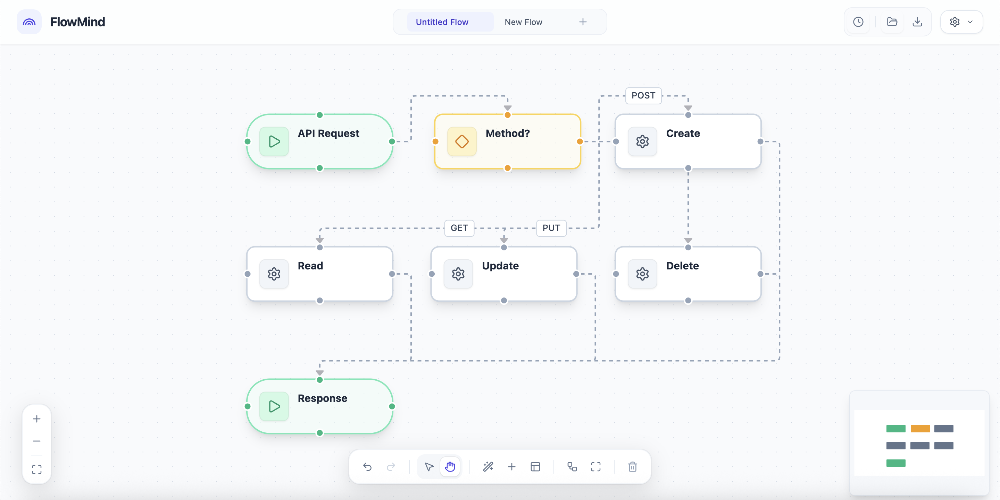

# FlowMind ⚡️


**The Open-Source, White-Label Diagramming Canvas.**  
Build beautiful, branded flowcharts with a tool that feels like a billion-dollar startup product. **100% Free & Open Source.**

FlowMind is the ultimate **White-Label Solution** for developers who need a premium diagramming tool embedded in their workflow, or just want a better way to diagram code.



---

## 🌟 Why FlowMind?

-   **MIT Licensed**: Completely free to use, modify, and integrate into your own commercial projects.
-   **True White-Label**: The entire UI dynamically adapts to **YOUR** brand. It's designed to look like *your* product, not ours.
-   **Diagram-as-Code Native**: Paste Mermaid.js or use our DSL. We treat diagrams as data.
-   **Premium UX**: Glassmorphism, smooth animations, and granular interactions that usually cost money.
-   **Privacy Focused**: BYOK (Bring Your Own Key) for AI means your data stays with you.

---

## 🔥 Key Features

### �️ White-Label Brand Engine
Make FlowMind your own. Our state-of-the-art theming system allows you to completely re-skin the editor:
-   **Brand Kits**: create unlimited identity presets (e.g., "Client A", "Dark Mode", "Wireframe").
-   **Dynamic Typography**: Automatically loads and applies **Google Fonts** to match your website.
-   **Smart Coloring**: Provide your brand's Primary Color, and we auto-generate a harmonious palette (Surface, Background, Accents).
-   **UI Physics**: Toggle **Glassmorphism**, adjust **Corner Radiuses**, and fine-tune border weights.

### 💠 Design Systems & Styling
Fine-grained control over how your diagrams look.
- **Component-Level Styling**: Define exact styles for **Nodes** (Shape, Color, Border) and **Edges** (Stroke, Pattern, Routing).
- **Design System Panel**: Manage your design tokens directly relative to the canvas.
- **Smart Inheritance**: New nodes automatically inherit the active design system's properties.

### 🖌️ Native Figma Export
Stop screenshotting your diagrams. FlowMind generates clean, structured SVGs that behave like native Figma layers.
- **Editable Text**: Labels and sublabels export as `<text>` blocks, not paths. Fix typos in Figma without redrawing.
- **Vector Fidelity**: Perfect rounded corners, gradients, and stroke precision.
- **One-Click Copy**: Just hit "Copy for Figma" and paste (Cmd+V).

### 🛠 Advanced Diagram as Code
First-class support for **Mermaid.js** and our own **FlowMind DSL**.
- **Expanded Support**: Now supporting **Flowcharts**, **State Diagrams**, and **Subgraphs** (Groups).
- **Live Sync**: Tweaking the visual graph updates the underlying code structure.

### 💎 Premium UX & Smart Editor
- **Intelligent Properties Panel**: Context-aware side panel for editing Node/Edge properties with brand-aware controls.
- **Keyboard Shortcuts**: `Cmd/Ctrl + K` Command Bar for instant access to every action.
- **Home Dashboard**: A beautiful, minimalist dashboard to manage your recent flows and brand settings.
- **Drag & Drop**: Intuitive drag-and-drop interface for image assets and nodes.
- **Universal Handles**: Omni-directional connection points that just work.

### 🔑 Bring Your Own Key (BYOK)
Use your own **Gemini API Key** to power the AI features.
-   **Privacy First**: Your key is stored locally in your browser and never sent to our servers.
-   **Higher Limits**: Use your personal quota for heavy usage.
-   **Cost Control**: Manage your own billing directly with Google.

### 📤 Universal Export
Export your diagrams to the format you need.
-   **High-Res PNG**: Crystal clear images for presentations.
-   **Native SVG**: Scalable vectors for print or web.
-   **JSON & Mermaid**: Export the raw code to share or version control.

### 📐 Advanced Auto-Layout
Powered by the **ELK Layout Engine** for professional-grade graph organization.
- **4 Algorithms**: Layered (standard flow), Tree (org charts), Force (organic networks), and Radial.
- **Animated Transitions**: Watch your graph smoothly reorganize itself.

---

## 🏗️ Architecture & Project Structure

Built for performance and extensibility using the best modern web tech:

- **Core**: [React Flow](https://reactflow.dev/) + [Vite](https://vitejs.dev/)
- **State Management**: [Zustand](https://zustand-demo.pmnd.rs/) for multi-tab shared state and persistence.
- **Language**: [TypeScript](https://www.typescriptlang.org/) for type-safe reliability.
- **Styling**: [Tailwind CSS](https://tailwindcss.com/) with a dynamic **CSS Variable** theme engine.

### File Tree

```bash
FlowMind/
├── src/
│   ├── components/
│   │   ├── properties/       # Node/Edge property panels (Brand-aware)
│   │   ├── SettingsModal/    # Brand & App configuration
│   │   ├── ui/               # Reusable primitives (Buttons, Inputs, Sliders)
│   │   ├── CommandBar.tsx    # Cmd+K interface
│   │   ├── FlowCanvas.tsx    # Main diagram editor
│   │   ├── HomePage.tsx      # Dashboard & File management
│   │   └── TopNav.tsx        # Navigation & Actions
│   ├── hooks/
│   │   ├── useBrandTheme.ts  # Dynamic CSS variable injection
│   │   ├── useFlowHistory.ts # Undo/Redo logic
│   │   ├── useAutoSave.ts    # Persistence sync
│   │   └── useSnapshots.ts   # File versioning
│   ├── services/
│   │   ├── brandService.ts   # Palette generation & Theme logic
│   │   ├── exportService.ts  # Image & JSON export
│   │   ├── mermaidParser.ts  # Diagram-as-Code parsing
│   │   └── elkLayout.ts      # Auto-layout engine
│   ├── store.ts              # Global Zustand store
│   └── theme.ts              # Default theme constants
├── public/                   # Static assets
└── index.css                 # Base Tailwind & CSS Variables
```

---

## 🚀 Getting Started

1. **Clone the repo**
   ```bash
   git clone https://github.com/Vrun-design/FlowMind.git
   cd FlowMind
   ```

2. **Install dependencies**
   ```bash
   npm install
   ```

3. **Run locally**
   ```bash
   npm run dev
   ```

---

## 🤝 Contributing

We want FlowMind to be the standard open-source diagramming tool for developers.
PRs are highly encouraged!

- **Found a bug?** Open an issue.
- **Want a feature?** Start a discussion.
- **Love the tool?** ⭐ **Star this repo!** It helps us ship faster.

---

## 📄 License

MIT © [Varun]


