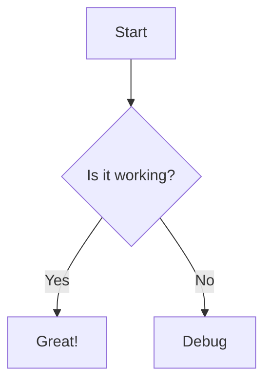

FlowMind maintains high compatibility with [Mermaid.js](https://mermaid.js.org/), the industry standard for diagram-as-code.

## Importing Mermaid

You can paste existing Mermaid code directly into FlowMind.

1.  Click the **"Import"** button in the toolbar.
2.  Select **"Mermaid"**.
3.  Paste your code snippet.

### Supported Diagram Types
Currently, FlowMind optimizes for:
*   **Flowcharts** (`graph TD`, `graph LR`)
*   **Sequence Diagrams** (Partial support via conversion)

## Exporting to Mermaid

You can also export any FlowMind diagram *back* to Mermaid syntax.
This is perfect for embedding diagrams in GitHub `README.md` files or Notion documents.

1.  Open the **Code Panel** (bottom panel).
2.  Switch to the **"Mermaid"** tab.
3.  Copy the generated code.
